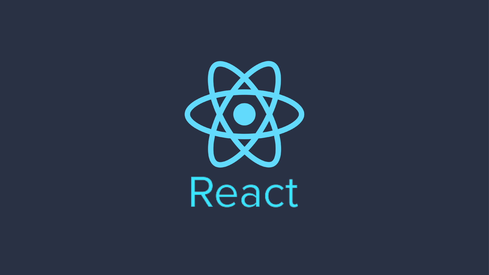
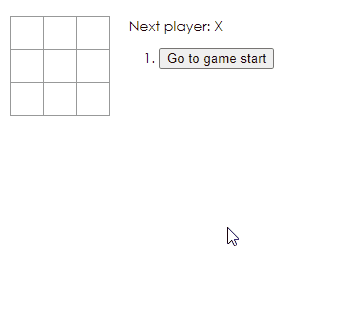

<h1 align="center">
  

<h2>  Projeto:</h2>

<p> Aplicação interativa de um jogo-da-velha.
</p>
<p><strong>Tecnologias utilizadas:</strong></p>
 <ul>
    <li>Reactjs</li>
    <li>CSS</li>
    <li>JSX</li>
</ul>

<strong>Objetivo:</strong>
<p> 
Conhecer mais sobre a biblioteca JavaScript.
Aprender as técnicas fundamentais para criar qualquer aplicativo React, como:</p>
<uL>
  <li>Componentes e Props</li>
  <li>Renderização de elementos JSX</li>
  <li>State e ciclo de vida, etc.</li>
</ul>
<br />
<h2> 
Como utilizar:</h2>
<p> Você precisa ter em sua máquina um editor de texto de sua preferência e um gerenciador de pacotes.</p>
   
<h3> Passos <h3>
<h4> 1. Clonar repositório <h4>

```
 $ git clone https://github.com/viictorcamposs/first-react-app
```

<h4> 2. Executar o aplicativo no seu terminal <h4>

```
#Iniciar o servidor 

$ yarn start

```
<br />
<h2> Resultado</h2>
<br />
